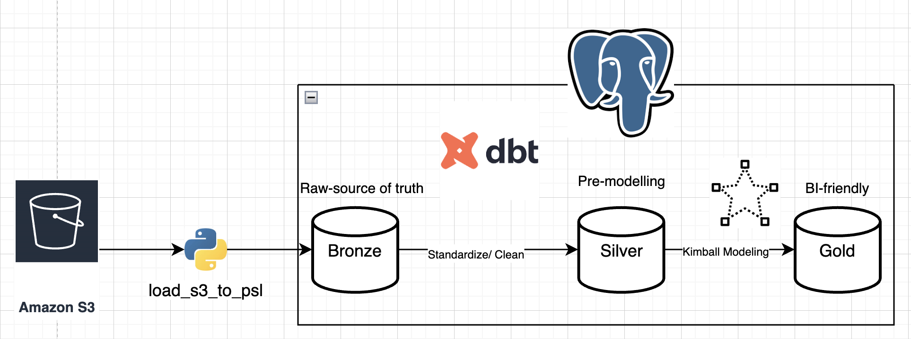

# 🏡 Zillow Real Estate Analytics — dbt Star Schema Project

This project implements a **modern, production-style data transformation pipeline** for real estate analytics using historical Zillow property listing data. Raw snapshot-based listing data is transformed into a **well-structured star schema** using **dbt**, enabling time-aware analysis of property prices, listing behavior, and market dynamics.

The project follows **industry best practices** in dimensional modeling, incremental fact tables, data quality testing, and documentation-driven development.


## 🗂 Project Structure

```
real_estate_transformation/
├── zillow_transformation/
│   ├── models/
│   │   ├── silver/
│   │   │   ├── staging/                # Source-aligned cleaned models
│   │   │   │   └── stg_zillow_property_master.sql
│   │   │   ├── intermediate/           # History + latest rollups
│   │   │   │   ├── int_zillow_property_history.sql
│   │   │   │   └── int_zillow_property_latest.sql
│   │   │   └── schema.yml              # Silver tests & documentation
│   │   ├── gold/
│   │   │   ├── dimensions/
│   │   │   │   ├── dim_property.sql
│   │   │   │   └── dim_date.sql
│   │   │   ├── facts/
│   │   │   │   ├── fact_property_snapshot.sql
│   │   │   │   └── fact_property_latest.sql
│   │   │   └── schema.yml              # Gold tests & documentation
│   ├── models/sources.yml
│   ├── dbt_project.yml
│   └── packages.yml
├── data_model_material/                # Schema diagrams & definitions
│   ├── Star_schema.png
│   └── tech_stack.png
└── README.md
```

---

## ⚙️ Technology Stack

- **Data Source**: Historical Zillow property listings, ingested via API and stored in AWS S3
- **Programming Language**: SQL + Jinja (dbt)
- **Data Warehouse**: PostgreSQL
- **Transformation Tool**: dbt Core (v1.10+)
- **Modeling Approach**: Kimball Star Schema
- **Change Tracking**: Snapshot-based history in silver + incremental facts in gold

> This project intentionally uses PostgreSQL to demonstrate that dbt is effective beyond cloud-native warehouses.

---

## 🧱 Data Architecture
This project leverages the bronze-silver-gold methodology to structure data flow and modeling, ensuring clear separation between raw ingestion, standardized staging, and analytics-ready outputs.
### 1️⃣ Data Source (Bronze)

Property listing data is ingested from the Zillow API and stored as a **history table**. For details about scraping and ingestion process, please refer to my repo about [zillow_data_extract](https://github.com/HaDo1802/zillow_data_extract).

Each row represents the full state of a property listing at the time of extraction.

Captured attributes include:
- Zillow property identifier
- Snapshot date
- Price and Zestimate values
- Bedrooms, bathrooms, living area, lot size
- Property type and listing status
- Address and geospatial information
- Listing activity flags (open house, images, 3D model)
- Metadata timestamps

This raw table is **append-only** and preserves the full change history.

---

### 2️⃣ Staging Layer (Silver)

**Model: `stg_zillow_property_master`**

Purpose:
- Standardize column names (`snake_case`)
- Normalize data types
- Apply light cleansing rules
- Preserve original grain

Grain:
> One row per property per snapshot date, defined by each ingestion run.

The staging layer acts as a **contract** between raw ingestion and business modeling.

---

### 3️⃣ Business-Ready Layer (Gold)

Purpose:
- Curate **analytics-ready** dimensions and facts for BI and reporting
- Provide **consistent grains** and conformed keys
- Support **point-in-time** analysis via snapshot facts

Grain:
> Dimensions are **one row per property** (latest known attributes), and the primary fact is **one row per property per snapshot date**, powering sclable, quick, and accurate business analysis.

---

## 🌐 Data Modeling Approach ( How to brainstorm for Gold Layer)

### Step 1: Business Process

The core business process is **tracking real estate listings over time**.

Each time Zillow data is scraped, the state of a property listing is captured.  
Changes in price, listing status, or property attributes represent meaningful business events.

---

### Step 2: Define the Grain

The grain of the primary fact table is defined as:

> **One row per property per snapshot date**

This grain ensures:
- Accurate historical analysis
- Time-based trend evaluation
- No loss of detail from the source

---

### Step 3: Identify Dimensions

Dimensions provide descriptive context around each listing snapshot. Leveraging **Slowly Changing Dimension 2 (SCD 2)** to overwrite the location-based columns, which happens rarely.

#### `dim_property`
Latest known property attributes including location details:
- street_address
- city
- state
- zip_code
- vegas_district
- latitude / longitude
- property_type

---

#### `dim_date`
Standardized calendar dimension supporting:
- calendar hierarchy (day, month, quarter, year)
- weekend flags
- fiscal attributes

Used for all time-based joins.

---

### Step 4: Facts for Measurement

#### `fact_property_snapshot`

Stores **time-variant, measurable metrics** for each snapshot:

Metrics:
- price
- zestimate
- rent_zestimate
- days_on_zillow
- bedrooms
- bathrooms
- living_area
- normalized_lot_area_value / normalized_lot_area_unit
- listing_status

Flags:
- Not currently stored in the gold facts (available in silver if needed).

Foreign keys connect each record to:
- property dimension
- snapshot date

---

## ⭐ Star Schema Overview

The model follows a classic **star schema** design.

| Fact Table Column | Dimension Table | Description |
|------------------|-----------------|-------------|
| property_id | dim_property | Property attributes (latest record per property) |
| snapshot_date | dim_date | Time of snapshot |

This structure supports efficient filtering, aggregation, and historical analysis.


---

## 🔄 Historical Tracking

Historical changes are preserved via the **snapshot-based grain** in silver and the **incremental snapshot fact** in gold. This enables point-in-time reporting without overwriting history.

---

## 🧪 Data Quality Framework

Data quality is enforced using dbt tests:

- `not_null` on primary keys
- `unique` constraints on dimension keys
- `relationships` tests for foreign keys
- Accepted values tests for categorical fields
- Snapshot consistency checks

---

## 📈 Analytics Use Cases

- Property price trends over time
- Market activity by location
- Listing lifecycle analysis
- Snapshot-based point-in-time reporting
- Property attribute change tracking

---

## 🚀 Why This Project Matters

This project demonstrates:
- Real-world dimensional modeling
- Incremental fact table design
- Professional dbt project structure
- Warehouse-agnostic transformation logic

It is designed to be **portfolio-ready** and easily extendable to cloud data warehouses.

---
