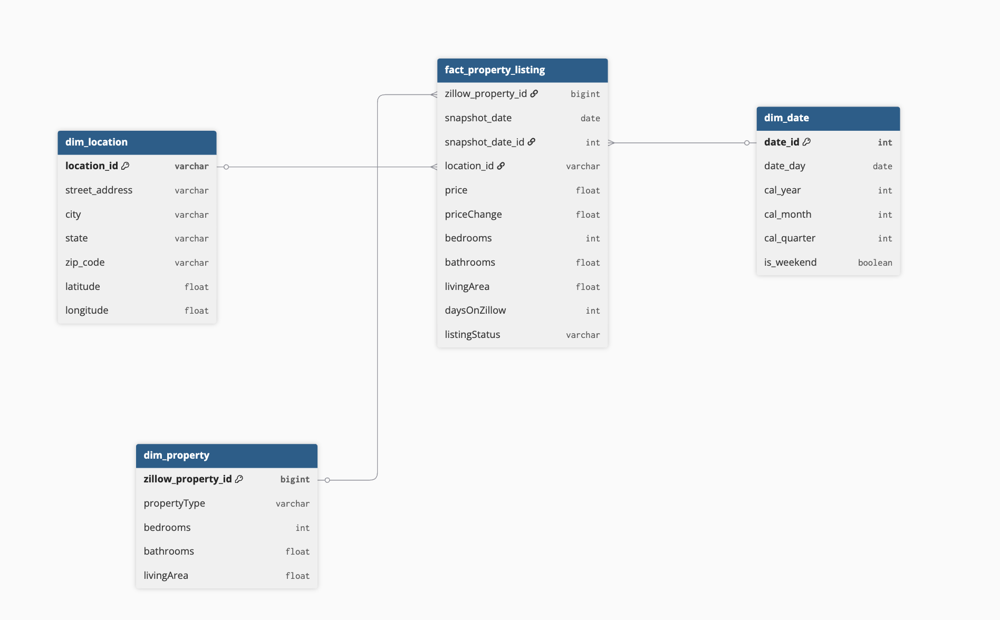

# 🏠 Real Estate Listings Analytics Platform

A modern analytics engineering project that transforms raw real estate listing data into a **clean star schema** using **dbt** and **PostgreSQL** (warehouse). The model is designed to support property-level analysis, price trend tracking, and market benchmarking across locations and time.

---

## 🧱 Data Architecture

### 1️⃣ Data Source
Property listings are collected from external real estate data sources (e.g., Zillow-style datasets) and ingested as CSV files into a raw schema.

**Captured attributes include:**
- Property identifier (e.g., `zillow_property_id`)
- Snapshot date (daily or periodic listing snapshot)
- Location details (country, state, city, ZIP)
- Property characteristics (bedrooms, bathrooms, lot size, property type)
- Listing status (coming soon, contingent, active, sold)
- Pricing information (current price, date price changed)

The data represents **point-in-time snapshots**, enabling historical tracking of listing and pricing changes.

---

## 🧩 Data Model

### ⭐ Star Schema Design
The warehouse follows a **classic star schema**, with one central fact table surrounded by descriptive dimensions.

#### 🧠 Business Process
The core business process is **property listing snapshots**. Each snapshot captures the state of a property listing at a specific point in time, including pricing and status information.

#### 🎯 Grain Definition
> **One property per snapshot date**

Each row in the fact table represents the state of a single property on a given snapshot date. This grain supports time-series analysis such as price changes, inventory trends, and market movement.

---

### 📊 Fact Table

**fct_property_listing**
- One row per property per snapshot date
- Stores price-related metrics and listing status flags
- Links to descriptive dimensions via surrogate keys

---

### 🧭 Dimension Tables

- **dim_property** – Physical characteristics of the property
- **dim_location** – Geographic context (country, state, city)
- **dim_date** – Calendar date attributes for snapshot and event dates

---

## 🔗 Schema (Text Version – `schema.txt`)

Schema built with tables as shown below:



---

## 🔄 Data Flow

1. **Source Layer**
   - CSV ingestion into PostgreSQL raw schema

2. **Transformation Layer**
   - dbt staging models for cleaning and typing
   - dbt mart models for dimensions and fact tables

3. **Orchestration Layer**
   - Scheduled dbt runs (Airflow-ready for future extension)

4. **Presentation Layer**
   - Analytics-ready star schema for BI and ad-hoc SQL

---

## 🛠 dbt Project Structure

```
models/
├── staging/
│   └── stg_properties.sql
├── marts/
│   ├── dim/
│   │   ├── dim_property.sql
│   │   ├── dim_location.sql
│   │   └── dim_date.sql
│   └── fact/
│       └── fct_property_listing.sql
└── schema.yml
```

---

## ✅ Data Quality Framework

Implemented using **dbt tests**:
- Not-null and uniqueness checks on primary keys
- Foreign key relationship validation
- Accepted values for listing status fields
- Snapshot-date completeness checks

---

## 📦 Key Dependencies

- `dbt-postgres`
- `pandas`

Managed via `requirements.txt`.

---

## 🚀 Outcomes

This data model enables:
- Property price trend analysis over time
- Inventory and listing status monitoring
- Market comparisons by city, state, or country
- A strong foundation for future SCD and incremental modeling

---

This project is designed as an **analytics engineering portfolio project**, demonstrating dimensional modeling, dbt best practices, and production-ready documentation.

