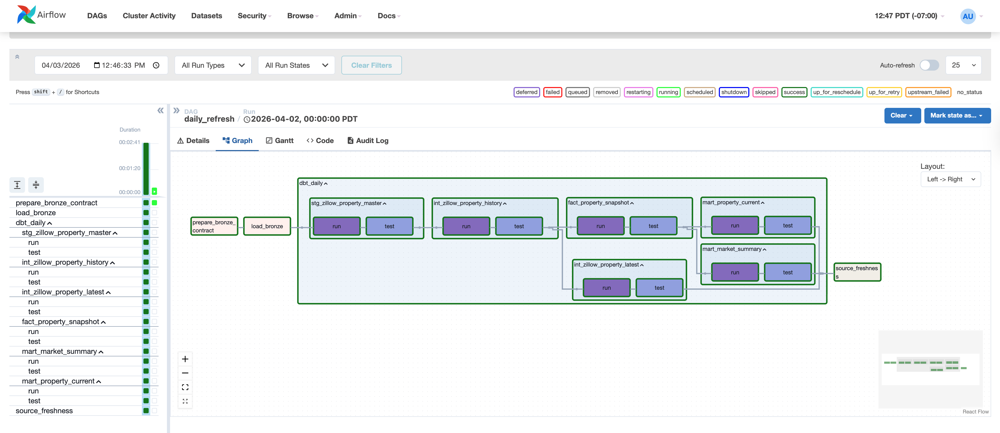
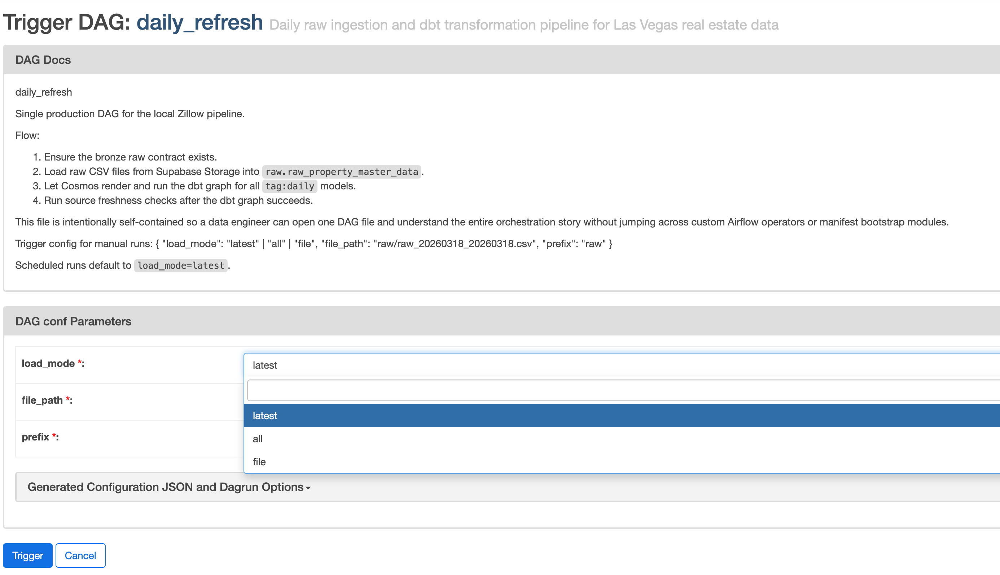

[](https://github.com/HaDo1802/zillow_data_transformation/actions/workflows/ci.yml)
[](https://github.com/HaDo1802/zillow_data_transformation/actions/workflows/deploy_prod.yml)
[](https://github.com/HaDo1802/zillow_data_transformation/actions/workflows/scheduled_orchestration.yml)
# Zillow Real Estate Analytics (dbt + Supabase)

An analytics engineering project demonstrating production-grade data transformation for Zillow listing history. Built with a bronze-silver-gold medallion architecture, dbt Core, and GitHub Actions CI/CD to power the [Real Estate Analytics App](https://vegas-realestate-analysis.streamlit.app/).


## Project Overview
**Tech Stack**

[](https://www.getdbt.com/)
[](https://supabase.com/)
[](https://airflow.apache.org/)
[](https://www.astronomer.io/cosmos/)
[](https://www.docker.com/)
[](https://github.com/features/actions)
[](https://streamlit.io/)
[](https://pytest.org/)

**Design Thinking**
- Contract-driven modeling: raw ingestion contract is explicit and versioned in SQL + loader code.
- Grain-first data modeling: each model has a clear business grain before metrics are added.
- Idempotent ingestion and transformation: duplicate-safe raw loads and deterministic downstream builds.
- State-aware deployment: only changed dbt graph nodes are promoted to production.
- Operational discipline: CI isolation schemas, automated cleanup, and scheduled incremental refresh.

## Repository Layout

```text
real_estate_transformation/
├── dags/
│   └── daily_refresh.py        # Airflow DAG for the scheduled daily pipeline
├── scripts/
│   ├── python/
│   │   └── load_bronze.py      # 2 Load files into raw table
│   └── sql/
│       └── bronze_setup.sql    # 1. Use it for your raw table set up first
├── zillow_transformation/      # 3. All transformation models using dbt
│   ├── dbt_project.yml
│   ├── models/
│   │   ├── sources.yml
│   │   ├── silver/
│   │   │   ├── staging/stg_zillow_property_master.sql
│   │   │   ├── intermediate/int_zillow_property_history.sql
│   │   │   ├── intermediate/int_zillow_property_latest.sql
│   │   │   └── schema.yml
│   │   └── gold/
│   │       ├── dimensions/dim_property.sql
│   │       ├── dimensions/dim_date.sql
│   │       ├── facts/fact_property_snapshot.sql
│   │       ├── marts/mart_market_summary.sql
│   │       ├── marts/mart_property_current.sql
│   │       └── schema.yml
└── .github/workflows/
    ├── ci.yml
    ├── deploy_prod.yml
    └── scheduled_orchestration.yml
```

## Airflow Orchestration

Airflow is the orchestration and observability layer for the local production-style pipeline.

`daily_refresh` DAG automates:

```text
prepare_bronze_contract    # Set up running environment
  -> load_bronze           # Raw data ingestion into landing layer
  -> dbt_daily             # Cosmos renders tag:daily graph to create DAG graph
  -> source_freshness
```

### Daily Pipeline



### Manual Backfill and Trigger Options

When analysts need to backfill data, for example initial load, debugging specific days, or manually kicking off delayed pipeline, this Airflow offers explicit trigger options.



## Data Architecture and Modeling Principles

## 1) Bronze (Raw Contract)

Raw table: `raw.raw_property_master_data`  
Setup: `scripts/sql/bronze_setup.sql`

Design choices:

- Keep raw fields as text to preserve source fidelity and avoid early coercion errors.
- Derive `snapshot_date` at ingest time from `extracted_at` (day-level, `YYYY-MM-DD`) in `load_bronze.py`.
- Enforce idempotency with a business-level uniqueness rule:
  - `unique (zpid, snapshot_date, price, listingstatus)`
- Loader uses `ON CONFLICT ON CONSTRAINT raw_property_master_data_uk DO NOTHING`.

This gives safe re-runs, backfills, and resilience to duplicated file deliveries.

## 2) Silver (Standardization + History)

Silver models standardize schema, cast types, and apply light business normalization.

- `stg_zillow_property_master`: source-aligned typed staging contract.
- `int_zillow_property_history`: historical continuity at event-level grain.
- `int_zillow_property_latest`: latest-record projection per property.

Principle: silver is where technical quality is enforced; gold should not re-clean dirty source behavior.

## 3) Gold (Business Serving Layer)

Gold models provide analytics-ready dimensions, facts, and marts.

- Dimensions: `dim_property`, `dim_date`
- Fact: `fact_property_snapshot` (time-aware metrics)
- Marts: `mart_market_summary`, `mart_property_current`

Principle: conformed dimensions + stable fact grain for repeatable BI semantics.


## Modeling Brainstorm and Design Decisions

This is the decision path used to shape the gold model, not just the final SQL structure.

1. Business process first

- Core process: track how each listing changes over time (price, status, activity).
- Modeling implication: prioritize time-variant fact design over a single current-state table. Even though the api data is not providing ideal data for time-series analysis, mainly due to my small volume of free quote, I still want to mimic the real-world production-grade handling strategy.

2. Grain before columns

- Chosen fact grain: one row per `property_id` per `snapshot_date`.
- Why: this supports trend analysis, avoids accidental double counting, and makes testable uniqueness explicit.

3. Dimension vs fact boundary

- Dimensions store descriptive context with lower volatility (`dim_property`, `dim_date`). I chose SCD1 for dim_propery because the I wanted to focus on the point-in-time pricing analysis over the time-series analysis now.
- Facts store measurable and changing values (`fact_property_snapshot`).
- Why: keeps joins stable and avoids repeatedly storing high-cardinality descriptive text in fact tables. I am thinking of "what-if" situation when my data is scaling to millions.

4. Keep both history and current-serving marts

- Historical truth: `fact_property_snapshot`.
- Consumer convenience: latest-serving marts (`mart_property_current`) and aggregate marts (`mart_market_summary`).
- Why: BI users need both point-in-time analysis and fast current-state dashboards.

## Tagging Strategy (Execution Semantics)

Tags area added for better control. All models have at least 2 tags: frequency and layer

- Silver folders default to: `["daily", "silver"]`
- Gold dimensions: `["one-time", "gold", "dimension"]`
- Gold facts: `["daily", "gold", "fact"]`
- Gold marts: `["daily", "gold", "mart"]`

This enables precise selectors like:

- `dbt run --select tag:daily`
- `dbt run --select tag:one-time`

- Silver folders default to: `["daily", "silver"]`
- Gold dimensions: `["one-time", "gold", "dimension"]`
- Gold facts: `["daily", "gold", "fact"]`
- Gold marts: `["daily", "gold", "mart"]`

Model-level tags are also explicitly declared in `schema.yml` for readability and governance.

This supports clean selectors like:

- `dbt run --select tag:daily`
- `dbt run --select tag:one-time`

## CI/CD Design

Workflows:

- `.github/workflows/ci.yml`
- `.github/workflows/deploy_prod.yml`
- `.github/workflows/scheduled_orchestration.yml`

Branch target:

- `master`

Path filters:

- Pipelines run only for dbt/ingestion/workflow-relevant files, reducing bombarded noisy run.

### CI (`pull_request -> master`)

Goals: fast feedback + isolated validation, never touches prod target.

1. `lint` job

- `dbt deps`
- `dbt compile --target ci`

2. `test` job (depends on lint)

- Download latest prod manifest artifact (`dbt-manifest-prod`, continue-on-error for bootstrap)
- `dbt seed --target ci`
- `dbt run --select state:modified+ --state ../prod-manifest --defer --target ci --full-refresh`
- `dbt test --select state:modified+ --state ../prod-manifest --target ci`
- Always drop ephemeral schemas:
  - `ci_${CI_RUN_ID}_silver`
  - `ci_${CI_RUN_ID}_gold`

### Production Deploy
Only run when the ci workflow is passed!

Workflow:

- `.github/workflows/deploy_prod.yml`

Job:

- `deploy_changed_models` (`push -> master` and `workflow_dispatch`)

- `dbt deps`
- `dbt seed --target prod`
- `dbt run --select state:modified+ --state ../prod-manifest --defer --target prod`
- `dbt test --select state:modified+ --state ../prod-manifest --target prod`
- Upload `target/manifest.json` as artifact `dbt-manifest-prod` (30 days)

### Scheduled Orchestration
My alternative option to automate the transformation pipeline instead of using EC2 or other cloud choice

Workflow:

- `.github/workflows/scheduled_orchestration.yml`

Job:

- `daily_refresh` (`schedule: 0 7 * * *` and `workflow_dispatch`)

- `python scripts/python/load_bronze.py --latest`
- `dbt deps`
- `dbt run --select tag:daily --target prod`
- `dbt test --select tag:daily --target prod`
- `dbt source freshness --target prod`
- Upload fresh `dbt-manifest-prod`

Important:

- No `--full-refresh` in daily refresh.

## Airflow Local Workflow

Working local Docker flow:

```bash
docker compose up airflow-init
docker compose up -d --build
```

Validate bronze ingestion inside the scheduler container:

```bash
docker compose exec airflow-scheduler python /opt/airflow/scripts/python/load_bronze.py --latest
```

Validate dbt in the same runtime Airflow uses:

```bash
docker compose exec airflow-scheduler sh -c 'cd /opt/airflow/zillow_transformation && dbt deps --target prod && dbt compile --select tag:daily --target prod'
```

Manual Airflow trigger options for `daily_refresh`:

```json
{ "load_mode": "latest" }
```

```json
{ "load_mode": "all" }
```

```json
{ "load_mode": "file", "file_path": "raw/raw_20260318_20260318.csv" }
```

## Local dbt Run

```bash
cd zillow_transformation
dbt deps
dbt seed --target dev
dbt run --target dev
dbt test --target dev
```

Daily-tag local check:

```bash
dbt run --select tag:daily --target dev
dbt test --select tag:daily --target dev
```
